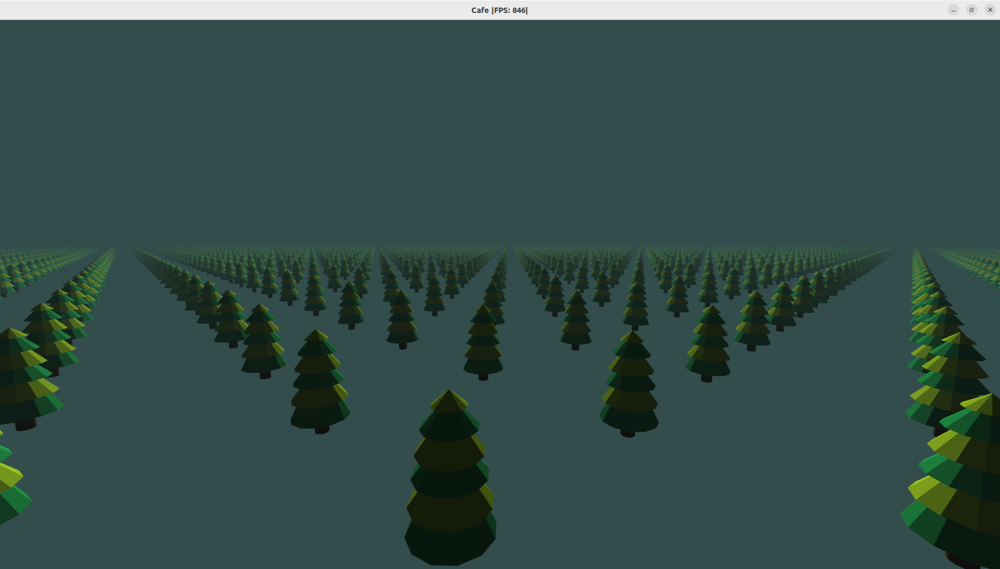
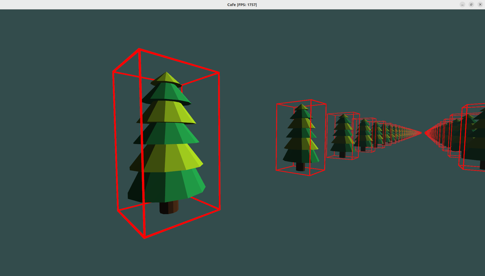

# Cafe - C++ Rendering Engine

## About
Cafe is a ECS driven rendering engine written in C++ that uses OpenGL 4.1. This project This project is currently in development and is not ready for use.

## Features
- Entity Component System
- Model/Texture Loading
- Lighting
- Camera Movement
- AABB Mesh Rendering

    
     
    <i>Renderring of 10,000 tree meshes</i>

    
     
    <i>Renderring of AABB meshes</i>

## Requirements
- glfw3
- glew
- glm
- assimp

